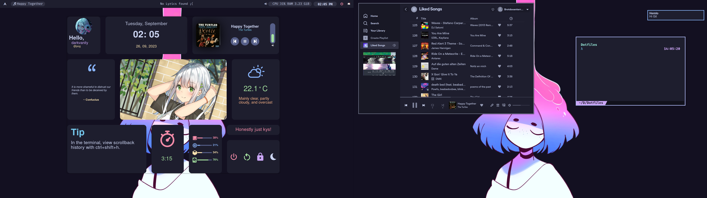

# My Dotfiles

These are my Dotfiles, they use the Catppuccin-Mocha Theme.
I have a Dual Monitor Setup so you might want to adapt some settings if you
are on one screen.

## I3 Gaps
As window manager I am using i3 gaps. 

### Installation
I3 Gaps is easily installed using pacman:
`sudo pacman -S i3-gaps`

### Config
The config is as easy as copying 
`.config/i3/config` to `~/.config/i3/config`

## Picom
We use Picom as the compositor because it is lightwheight and we don't really need 
alot of features from our compositor.

### Install
`sudo pacman -S picom`

### Config
We don't configure alot but we need some config done so,
copy `.config/picom/picom.conf` to `~/.config/picom/picom.conf`.

## Terminal
The Terminal we use is kitty.

### Installation
`sudo pacman -S kitty`

### Config
Copy the config from:  
`.config/kitty/kitty.conf` to `~/.config/kitty/kitty.conf`

and set the theme using
`kitty +kitten themes --reload-in=all Catpuccin-Mocha`

## Fish
As shell we are going to use fish.

## Install
`sudo pacman -S fish`

## Config
Copy the config from `.config/fish/*` to `~/.config/fish`
and set the theme using
`fish_config theme save "Catppuccin Mocha"`

## Starship
We need a nicer prompt so we install Starship.

### Install
`sudo pacman -S starship`

## Config
Copy `.config/starship.toml` to `~/.config/starship.toml`
SIGUSR1 dunst
## Editor
I am using Neo Vim with AstroNvim as Editor.

### Install
`sudo pacman -S neovim`

After that we need to install AstroNvim, for that we run
`git clone --depth 1 https://github.com/AstroNvim/AstroNvim ~/.config/nvim`

### Config 
To configure we just need to download our config from Github now and we are done.
`git clone https://github.com/DarkVanityOfLight/astrovim-config.git ~/.config/nvim/lua/user`

## Fonts
I only use the Fira Code Nerd font but if you want others go ahead.

### Install
You can either manually install or use the AUR
`yay -S ttf-firacode-nerd`

## Rofi
As drun replacement we use Rofi with the default Catpuccin-Mocha config

### Install
`sudo pacman -S rofi`

### Config
Copy `.config/rofi/*` to `.config/rofi`

## Eww
We have some widgets and for these I use eww. The install
is a bit wacky, but it is manageable

### Install

First we need the nightly toolchain of rust for that we best use rustup
`sudo pacman -S rustup`

After that we can build Eww using

`git clone https://github.com/elkowar/eww`
`cd eww`
`cargo build --release --no-default-features --features x11`

### Config
Once again you can find and copy the config from
`.config/eww/` to `~/.config/eww`

## I3lock-color
The powermenu lock widget uses I3lock-color, so we need that and configure
our lockscreen background.

## Install
`yay -S i3lock-color`

## Config
We are using a wallpaper as background, so move your image to:
`~/.config/lockscreen/lockscreen_image.png`
make sure it has the right dimensions if you are on a dual monitor setup.

## Polybar
As Bar I use Polybar.

## Install
`sudo pacman -S polybar`

## Config
Copy `.config/polybar` to `~/.config/polybar/`
and make sure you have the right audio controll set.

## Spotify/Spicetify
Normal Spotify looks shit so we use Spicetify to make it look nicer and get some
other boons, like Ad free content and a Lyric Server

## Install
`yay -S spotify spicetify-cli`

## Config
We are using the Dribbblish theme with custom colors,
my Lyric Server extension and an ad block extension.
You can go ahead and install those manually, but I m just going
to copy and paster with the risk of having a few bugs that you need to iron out.

Copy `.config/spicetify/` to `~/.config/spicetify/`

and set your own preference path in 
`~/.config/spicetify/config-xpui.ini`

at the line
`prefs_path = /home/darkvanity/.config/spotify/prefs`

to your right path aka

`prefs_path = /home/<username>/.config/spotify/prefs`

## Dunst
We display Desktop notifications using Dunst.

### Install

`sudo pacman -S dunst`

### Config
Copy `/.config/dunst` to `~/.config/dunst/`

## Other Packages

### Ranger
As file explorer I use ranger with the Kitty image preview

### Obsidian
This is my Note taking app I use.
You can install the Catppuccin theme from the store there

### Vivaldi
The Vivaldi Webrowser can be customized with a Catppuccin Theme from the store

### Nitrogen
To set my wallpapers I use Nitrogen

## Full Install

Here is the copy paste version of the whole install with as few commands as possible:

`mkdir -p ~/.config/i3 ~/.config/picom ~/.config/kitty ~/.config/fish ~/.config/rofi ~/.config/eww 
~/.config/lockscreen ~/.config/polybar ~/.config/spicetify ~/.config/dunst`

`sudo pacman -S i3-gaps picom kitty fish starship neovim rustup rofi polybar dunst`
`yay -S spotify spicetify-cli ttf-firacode-nerd i3lock-color`

`cp .config/i3/config ~/.config/i3/`
`cp .config/picom/picom.conf ~/.config/picom/`
`cp .config/kitty/kitty.conf ~/.config/kitty/`
`cp -r .config/fish/* ~/.config/fish`
`cp .config/starship.toml ~/.config/`
`cp -r .config/rofi/* ~/.config/rofi/`
`cp -r .config/eww/* ~/.config/eww/`
`cp -r .config/polybar/* ~/.config/polybar/`
`cp -r .config/spicetify/* ~/.config/spicetify/`
`cp -r .config/dunst/* ~/.config/dunst/`
or if you are brave:
`cp -r .config/* ~/.config/`

`kitty +kitten themes --reload-in=all Catpuccin-Mocha`
`fish_config theme save "Catppuccin Mocha"`
`git clone --depth 1 https://github.com/AstroNvim/AstroNvim ~/.config/nvim`
`git clone https://github.com/DarkVanityOfLight/astrovim-config.git ~/.config/nvim/lua/user`
`cd eww && cargo build --release --no-default-features --features x11`

or try the install script
`bash setup.sh`
